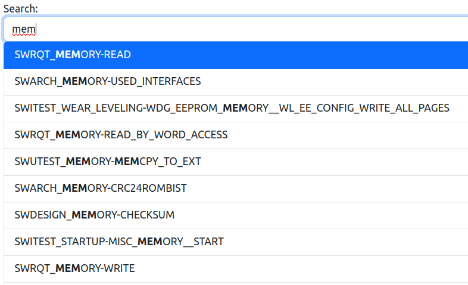

# Table of Contents

- [Overview](#overview)
- [Getting Started](#getting-started)
  - [JSON Database](#json-database)
- [Configuration](#configuration)
  - [html_documentation_root](#html_documentation_root)
  - [layered](#layered)
  - [layers](#layers)
  - [item_colors](#item_colors)
  - [link_colors](#link_colors)
  - [backwards_relationships](#backwards_relationships)
  - [visualised_properties](#visualised_properties)
- [Usage](#usage)
  - [Home Page](#home-page)
    - [Cypher Query](#cypher-query)
    - [Search](#search)
  - [Group Filter](#group-filter)
  - [Interactions](#interactions)
    - [Hide Groups](#hide-groups)
    - [Hide Links](#hide-links)
    - [Selecting a Node](#selecting-a-node)
    - [Hovering a Node](#hovering-a-node)
    - [HTML link in Info of Node](#html-link-in-info-of-node)
    - [Highlight Connected Nodes](#highlight-connected-nodes)
    - [Add/Show Connecting Nodes](#addshow-connecting-nodes)
    - [Node labels](#node-labels)
    - [Zoom buttons](#zoom-buttons)
    - [Errors](#errors)
- [Bugs](#bugs)
- [Features](#features)


# Overview

This traceability-viewer, a standalone tool, visualizes a collection of traceable documentation items in a network graph.
This allows the user to gain a better understanding of the relationships between different items.
Each node in the network graph represents an item, and can be grouped in layers, based on its identifier,
or force-directed. This and more options are [configurable](#configuration).

It was originally designed to use the JSON database exported by our
[Sphinx traceability plugin](https://github.com/melexis/sphinx-traceability-extension) as input
but any JSON database can work if it meets the minimum requirements, explained in [this section](#json-database).


# Getting Started

We use the tool Docker Compose to define and share multi-container applications. This tool makes use of a `docker-compose.yml` file. The `.env` file is meant to store and define environment variables, which are used in the `docker-compose.yml` file and in Python scripts.

First, you need to [install Docker Compose](https://docs.docker.com/compose/install/linux/#install-the-plugin-manually).

<!-- https://docs.docker.com/engine/reference/commandline/compose_up/ -->

After installation, copy the JSON file that contains the data to the project folder and copy the `.env.example` to `.env`. These environment variables requires modification.
```
# copy traceability_export.json file to project folder
cp /path/to/traceability_export.json .
# copy example .env to your .env
cp .env.example .env
```
Lastly, use docker compose to start the application.

```
docker compose up --build --remove-orphans
```

After a successful build, you can start the traceability viewer at port `8000` on the defined `IP_ADDRESS`.
If you use `0.0.0.0` as `IP_ADDRESS`, it`s 0.0.0.0:8000

## JSON Database

Our Sphinx plugin [mlx.traceability](https://melexis.github.io/sphinx-traceability-extension/index.html) can be configured to
[export](https://melexis.github.io/sphinx-traceability-extension/configuration.html#export) its collection of traceable documentation items in JSON format.

The environment variable `JSON_EXPORT` needs to be defined when you want to use the traceability viewer. This is the path to the JSON file that contains all the data. The items in the JSON file needs to have at least a name and targets.

It should be structured as (this is the minimum required):
```
[
    {
        "name" : "<name-of-item>",
        "targets": {
            "<relation-type-1>": [
                "<target-item-name-1>",
                "<target-item-name-2>",
                ...
            ],
            "<relation-type-2>": [
                "<target-item-name-3>",
                "<target-item-name-4>",
                ...
            ],
        }
    },
    ...
]
```


# Configuration

The configuration takes the form of a YAML file. The [config.yml](config.yml) is an example that requires modification.

## html_documentation_root

> [!NOTE]
> `html_documentation_root` is an optional configuration parameter.

The root of the the HTML project documentation; either a pathname or a URL.

This configuration parameter can only be used if [the JSON database](#json-database) contains a ``"document"`` attribute with the relative path to the reST file in which the item is defined,
and if the item ID/name is appended to the HTML filename with a `#`.
Our [traceability-plugin](https://melexis.github.io/sphinx-traceability-extension/configuration.html#export-to-json) does both.

## layered

> [!IMPORTANT]
> `layered` is a required configuration parameter.

The boolean option to layer the nodes or not.
- `true`: the layers will be made according to the [layers](#layers) configuration parameter.
- `false`: there are no layers. The nodes will be force directed.


## layers

> [!NOTE]
> `layers` is only required when `layered` is `true`.

The layers can be a _list_ or a _dict_ of [regular expressions](https://docs.python.org/3/library/re.html#regular-expression-syntax).

- _list_: A list is used when there is only **one** regular expressions needed per layer.
- _dict_: A dictionary is used when there are **two** regular expressions needed per layer.

The order of the layers defines the layer's position. The top and bottom layers are respectively to the first and last layer defined in the _list_ or _dict_.


## item_colors

> [!NOTE]
> `item_colors` is an optional configuration parameter, but keep in mind that when it is not specified, all nodes will be black (`others`).

A dictionary where the key is a regular expression and the value is the desired color of the node. The regular expression is used to [match](https://docs.python.org/3/library/re.html#re.match) (the beginning of) the name of a node with that particalor regular expression.
The color can be an existing [color name](https://www.w3schools.com/tags/ref_colornames.asp) or a [code](https://www.w3schools.com/colors/colors_picker.asp) (hex, rgb or hsl).

If `item_colors` is not specified, it automatically adds following code to the configuration file.
```
item_colors:
    others: black
```
If `item_colors` is defined but `others` isn't, it automatically adds `others: black` to `item_colors`.


## link_colors

> [!NOTE]
> `link_colors` is an optional configuration parameter, but keep in mind that when it is not specified, all relationships between nodes will be black (`others`).

A dictionary where the key is the name of relationship type and the value is the desired color of the relationship.
The color can be an existing [color name](https://www.w3schools.com/tags/ref_colornames.asp) or a [code](https://www.w3schools.com/colors/colors_picker.asp) (hex, rgb or hsl).

If `link_colors` is not specified, it automatically adds following code to the configuration file.
```
link_colors:
    others: black
```
If `link_colors` is defined but `others` isn't, it automatically adds `others: black` to `link_colors`.


## backwards_relationships

> [!IMPORTANT]
> `backwards_relationships` is a required configuration parameter.

A dictionary where the key is the backwards relationship and the value the forward relationship. To reduct the amount of links, only the forward relationhsips (values) will be displayed.

## visualised_properties

> [!NOTE]
> `visualised_properties` is an optional configuration parameter.

A list of all item properties to display after selecting a node. By default, its name/ID will be displayed, and,
in case [`html_documentation_root`](#html_documentation_root) has been configured,
the link to the item definition in your project documentation,.


# Usage

## Home Page

The home page looks like the following image. It consists of the bottons on top, two input fields respectively for a Cypher query and search for a node and at the bottom the interactions with showed network.


### Cypher Query

The input field for submitting a cypher query has two tooltips:

This is a link to the Cypher cheat sheet of Neo4j.


This tooltip makes you aware of the keywords that are not allowed.

The input field has an autocompletion as shown in this figure:

Suggestions starting with the same letter as the input, will be on top, followed by the suggestions containing it.

### Search

The search input field has as well autocompletion as shown in this figure:


The suggestions only contain the names of nodes because there is nothing else allowed.

## Group Filter

The group filter are based on the configuration file. If `layers` is given, these unique groups are groups to filter on. When `layers` is nog defined, the groups are based on the groups of the `item_colors`.
The filter button gives a filtring on the specified group (the name of the button), with all their connecting nodes.
An example of such an filter is shown in the following image.


The legend is based on the visible nodes and links. When diffrent nodes or links are added, the legend will be updated.

## Interactions

### Hide Groups

When clicking a group of the legend, this group will disappear. When clicking again, it reverts to previous.


### Hide Links

When clicking a link of the legend, this link will disappear. When clicking again, it reverts to previous.


### Selecting a Node

You can click on a node to select it. Additional info about the node will be displayed in the top left corner and
two additional buttons pop up:

- [Highlight Connecting Nodes](#highlight-connected-nodes)
- [Add/Show Connecting Nodes](#addshow-connecting-nodes)


### Hovering a Node

When hovering a nodes, the name of that node is shown.
In the previous image, the black node at the bottom was hovered by the mouse.

### HTML link in Info of Node

When `html_documentation_root` is specified, the name of the node will be a link to the documentation of that specific node.

### Highlight Connected Nodes

The button with the eye-icon highlights all nodes that are directly connected to the selected node and makes other nodes transparent.


### Add/Show Connecting Nodes

When the button **Add/show connecting nodes** is clicked, the nodes connecting to the selected node will be obtained. It will add new nodes or links, if there are any.

Before pushing the button:


After pushing the button:


### Node labels

The labels/names of the nodes are shown when the checkbox of **Nodes with labels** is active.


### Zoom buttons

There are three buttons for zooming, respectively zoom in, zoom out and zoom till the network fits the canvas.


### Errors

When an error occurs, a notification pops up at the top of the page. In the example below, an invalid Cypher query was submitted:


You can show the error by clicking **Show error message**:


You can close the error by clicking **X**.
If the error is not closed and another error occurs, all errors will be listed at the top of the page.

# Bugs

1. When showing the labels/names of the nodes, there is always one node that turns black.
1. When using the input fields, the autocompletion does not add the selected word at the right place,
when adding something in the middle.
1. When data is obtained via a Cypher query, some links are not visible.
When clicking on the eye-icon, connected nodes are visible but the links are not.
You can solve it by clicking on the `Add/show connecting nodes` button.

# Planned Features

- Errors could be popping up, you need to close it before you can go further. That way the user can't miss it.
- Faster rendering; open to suggestions
- Instead of disabling the button when submitted, stop the previous request when another submit is done.
- A node that has no group and thus belongs to the group `others`, is now centered at height.
Better would be to position this node on the same height as the first node that is connected to it.
- Add a reset button to remove/undo the active filter.
- Add the possibility to exclude items from the JSON database with a regular expressions that match their name.
For example, exclude all items that start with `MLX`.
